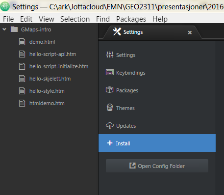
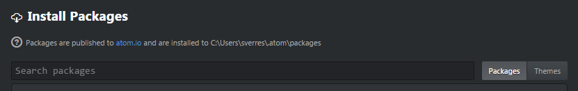
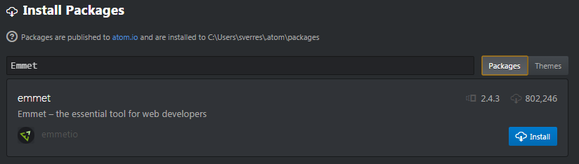
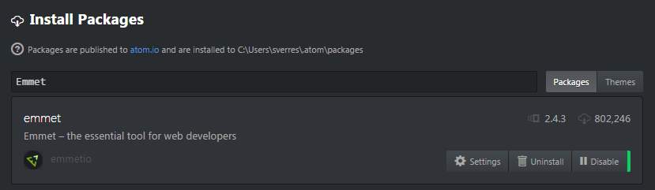

# Emmet - et hjelpemiddel for å skrive HTML- og CSS-kode raskt

Emmet er en tilleggspakke til Atom editor, og kan installeres på følgende måte:

- Gå til File/Settings/Install-menyen:

- Søk opp Emmet ved å søke i Packages:

- Installer Emmet:

- Emmet ferdig installert:

Etter et Emmet er installert kan du teste funksjonaliteten i en HTML-fil (Emmet virker bare i filer med endelse .html og .css, og kommandoene virker forskjellig i de to filtypene).

Skriv f.eks. disse kommandoene, plasser cursoren på samme linje som kommadoen og etter det siste tegnet. Trykk på tabulatortasten:

- !

- ul
- ol
- li

- ul>li*4
- ul>li*4>a:link
- p*3>lorem8

Den siste kommandoen bruker en generator for Lorem Ipsum-tekst. Les mer om det her:
- [Lorem Ipsum](http://docs.emmet.io/abbreviations/lorem-ipsum/)
- [Dokumentasjon for Emmet](http://docs.emmet.io/)
- [Jukselapp for Emmet-kommandoer](http://docs.emmet.io/cheat-sheet/) - se særlig under HTML
