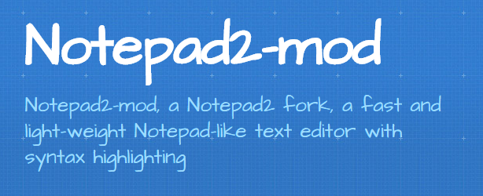

# Notepad 2 mod

Notepad 2 mod er en modifisert versjon av tekstbehandleren Notepad 2 som igjen er laget for å være en erstatter for Windows Notepad.

Gode grunner for å bruke Notepad 2 mod:

- rask
- håndtererer linjeskift på en god måte (viktig ved visning av filer)
- har fargekoding av programkode for å gi god oversikt over strukturen i koden
- har "code folding" - kan skjule deler av koden

Kontektsmeny vil si en meny som er tilpasset situasjonen (konteksten) du er i. For eksempel så kan menyen ha ulike valg avhengig av hvilken filtype du ser på. En type kontekstmeny kommer fram hvis du høyreklikker på en fil i en Windows-mappe.

## Hvordan legge til Notepad2 som et valg i kontekstmenyen?

- Notepad 2 mod må være installert
- Høyreklikk på [notepad-meny.reg](./docs/notepad-meny.reg) og lagre filen på egen PC. Åpne deretter mappen der du har lagret den og klikk på filen. Du vil få en advarsel, men du kan kjøre denne filen (Innholdet i filen kan du se [her](./docs/notepad-meny.txt) - dette er kommandoer som legger til et menypunkt i kontekstmenyen).
- høyreklikk på noen ulike filtyper og sjekk at du har valget Notepad2 på kontekstmenyen (Det skal normalt vises på alle filtyper).

Slik kan kontekstmenyen se ut:

