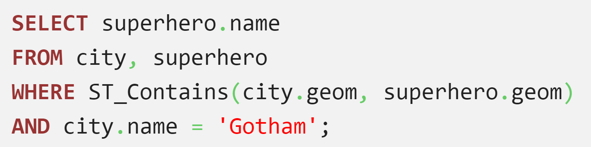
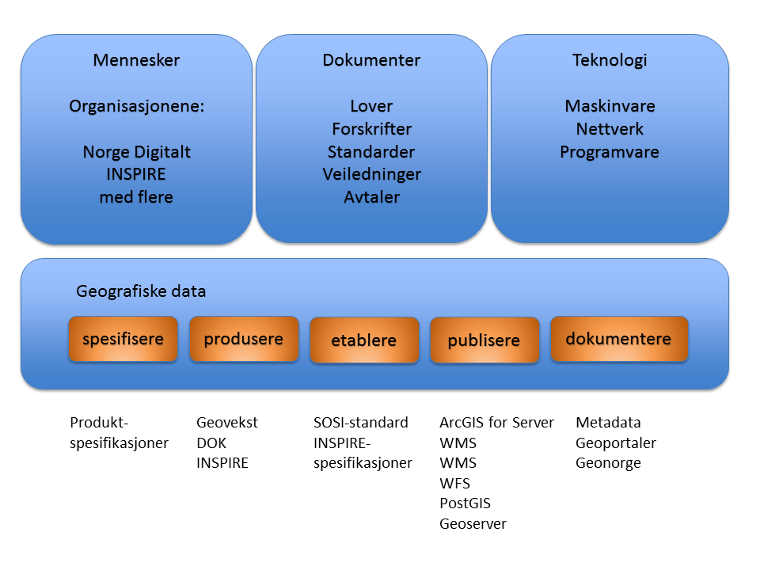
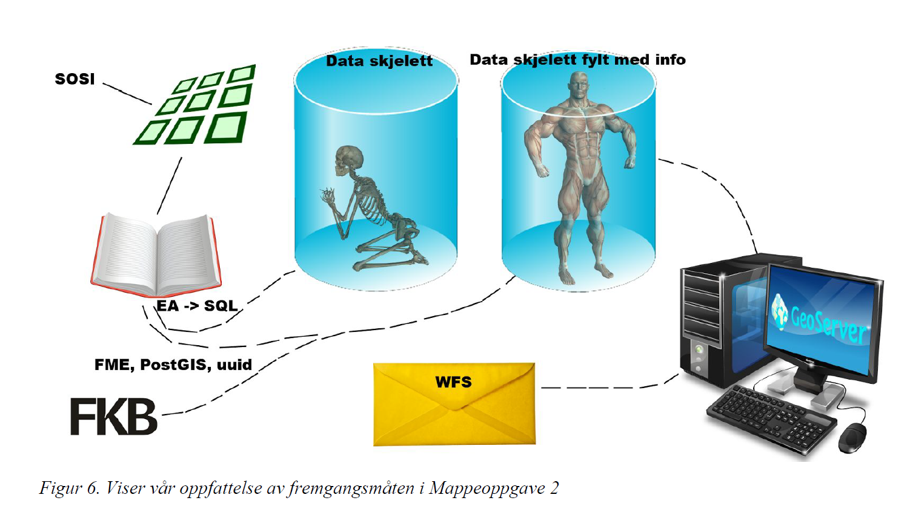
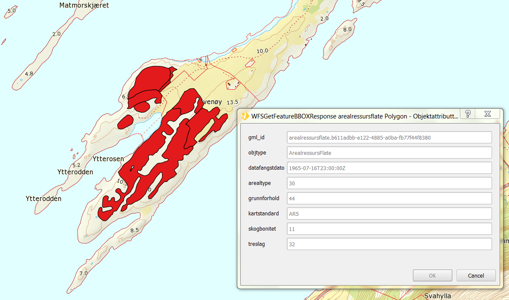

name: inverse
layout: true
class: center, middle, inverse
---
#Årsstudium i GIS

NTNU i Gjøvik
.footnote[Sverre Stikbakke - 14.06.2016]
---
layout: false

## Om studiet


### Årsstudium i Geografiske informasjonssystemer (GIS) er en IKT-utdanning der du som student spesialiserer deg i håndtering av geografisk informasjon og videre bruk av denne informasjonen.

- Opptakskrav

- Filosofi

---

## Emner


| Emnekode | Emne                                       |
|:---------|:-------------------------------------------|
| GEO1121  | GIS Intro                                  |
| IMT2261  | Informasjonsstrukturer og databaser        |
| GEO2311  | Geografisk informasjonsbehandling          |
|          |                                            |
| GEO1271  | Geografisk datafangst                      |
| GEO3141  | Infrastrukturer for stedfestet informasjon |
| GEO3101  | Geografisk analyse (alternativ 1)          |
| GEO2121  | Terrengmodeller    (alternativ 2)          |

---
name: inverse
layout: true
class: center, middle, inverse
---

# Geografisk informasjonsbehandling

---
layout: false

## Målsetting: Kunne lage webkart

### [Studentarbeid: Sysselsetting i primærnæringer, Oppland](http://www.stud.hig.no/~131008/oblig2_cloropleth.htm)

--
## Hva kreves?

- HTML
- CSS
- Javascript
- Kartverkets WMS/WMTS-tjenester
- Mapbox javascript-API
- Egne data på GeoJSON-format
    - Kommunekart
    - Statistikkdata fra SSB
---
## GetCapabilities

```xml
http://openwms.statkart.no/skwms1/wms.topo2
?SERVICE=WMS
&VERSION=1.3.0
&REQUEST=GetCapabilities
```

[#](
http://openwms.statkart.no/skwms1/wms.topo2
?SERVICE=WMS
&VERSION=1.3.0
&REQUEST=GetCapabilities
)

## Getmap

```xml
http://openwms.statkart.no/skwms1/wms.topo2
?VERSION=1.3.0
&REQUEST=GetMap
&CRS=EPSG:25832
&BBOX=592000,6741000,592200,6741200
&WIDTH=600
&HEIGHT=600
&LAYERS=Bygninger
&FORMAT=image/png
```

[#](
http://openwms.statkart.no/skwms1/wms.topo2
?VERSION=1.3.0
&REQUEST=GetMap
&CRS=EPSG:25832
&BBOX=592000,6741000,592200,6741200
&WIDTH=600
&HEIGHT=600
&LAYERS=Bygninger
&FORMAT=image/png
)

---

# Dagens Quiz

--



---
name: inverse
layout: true
class: center, middle, inverse
---

# Infrastrukturer for stedfestet informasjon

---
layout: false



---
# Tjenesteleveranser

## WFS-tjeneste:

- produktspesifikasjon basert på AR5
- modellering ut fra SOSI Objektkatalog
- etablering av PostGIS-database
- oppsett av tjeneste i GeoServer

---
## Sett med Kia og Elins øyne
(eller hvordan lage en "fullpumpet supersterk geografisk database")

--


---

# Filter Encoding-spørring mot WFS-tjeneste

```xml
<?xml version="1.0" encoding="utf-8"?>
<wfs:GetFeature 
    xmlns:wfs="http://www.opengis.net/wfs/2.0" 
    xmlns:prodskog6="http://ntnu.no/GEO3141">
  <wfs:Query typeNames="prodskog6:arealressursflate">
    <fes:Filter 
        xmlns:fes="http://www.opengis.net/fes/2.0" 
        xmlns:gml="http://www.opengis.net/gml/3.2">
      <fes:BBOX>
        <fes:ValueReference>omraade</fes:ValueReference>
        <gml:Envelope srsName="urn:ogc:def:crs:EPSG::25832">
          <gml:lowerCorner>339450 6569600</gml:lowerCorner>
          <gml:upperCorner>339600 6569800</gml:upperCorner>
        </gml:Envelope>
      </fes:BBOX>
    </fes:Filter>
  </wfs:Query>
</wfs:GetFeature>
```
---

```python
#!/usr/bin/env python
# -*- coding: utf-8 -*-

# File: WFSGetFeature.py
# A script for sending a request to a WFS-server
# Author: Sverre Stikbakke
# Date: 2016.03.02

import codecs
import urllib
import urllib2
import xml.dom.minidom

input_file = "WFSGetFeature.xml"
output_file = "WFSGetFeatureResponse.xml"
url = 'http://localhost:8080/geoserver/wfs'

print
print "url:        ", url
print "input file: ", input_file
```
---
```python
try:
  print
  print "Composing the request"
  data = open(input_file, "r").read()
  req = urllib2.Request(url, data)
  req.add_header('Content-Type', 'text/xml')
  
  print "Sending request and receiving response"
  response = urllib2.urlopen(req)

  print "Parsing and saving the response"
  doc = xml.dom.minidom.parseString(response.read())
  pretty_doc = doc.toprettyxml(indent="  ", encoding = 'utf-8')

  the_file = open(output_file, "w")
  the_file.write(pretty_doc)
  the_file.close()

  print
  print pretty_doc[0:300]
  print
  print "See complete results in " + str(output_file)

except:
  print
  print "Error - something went wrong - check filenames and url"

print
raw_input("OK? - press enter")
```
---



---
name: inverse
layout: true
class: center, middle, inverse
---

# Til slutt ...

---
layout: false

# Oppsummert - hva trenger vi fra Kartverket?

- WMS/WMTS-tjenester
- gode svar på GetCapabilities-forespørsler
- gode veiledere
    - Leveranser
    - WMS
    - WMTS (?) (Har brukt OGC-spesifikasjonen og GetCapabilities)
    - GML/Filter Encoding
    - Produktspesifikasjoner
    - Metadata
- rammeverksdokumentet
- WFS-tjenester - vi er klare!

---
# Noen ønsker

- alle lagnavn listes opp på GetCapabilities
- åpne wms-tjenester bør være mer synlige
- linker til veiledere og presentasjoner har kort levetid
    - ønsker permanente url'er som lever i flere år

---
name: last-page
template: inverse

## That's all folks (for now)!

Slideshow created using [remark](http://github.com/gnab/remark).
